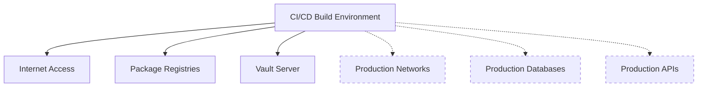

# Network Isolation Policy for CI/CD Environments

## Overview
This document outlines the network isolation requirements and controls for Cwork's CI/CD pipeline environments to prevent unauthorized access to production networks and resources.

## Policy Objectives
- Isolate build environments from production networks
- Prevent lateral movement between CI/CD and production systems
- Control outbound network access from build runners
- Implement defense-in-depth network security controls

## Network Segmentation Requirements

### 1. Environment Isolation


### 2. Allowed Network Destinations
Build runners may only access:
- **Package Registries**: npmjs.org, pub.dev, crates.io, pypi.org
- **Version Control**: github.com, api.github.com
- **Secrets Management**: vault.example.com (internal Vault server)
- **Security Tools**: snyk.io, dependabot.com, anchore.io
- **Documentation**: readthedocs.io, official package documentation sites

### 3. Denied Network Destinations
Build runners must NOT access:
- **Production Environments**: *.production.example.com, production APIs
- **Internal Databases**: database.internal, *.db.example.com
- **Management Interfaces**: admin.*, dashboard.*, port 22/3389 to internal networks
- **Sensitive Services**: internal authentication servers, payment processors

## Implementation Controls

### GitHub Actions Network Restrictions
```yaml
# Example network policy enforcement
permissions:
  contents: read
  packages: read
  actions: read
  # No write permissions to production resources
```

### Vault Secret Path Isolation
```bash
# Test environment secrets
secret/data/backend/auth-test
secret/data/contracts/ethereum-test
secret/data/mobile/app-test

# Production environment secrets (separate)
secret/data/backend/auth-prod
secret/data/contracts/ethereum-prod  
secret/data/mobile/app-prod
```

### DNS and Firewall Controls
- Implement split-horizon DNS to prevent resolution of production domains
- Configure firewall rules to block outbound traffic to production IP ranges
- Use network policies to restrict build runner egress

## Monitoring and Enforcement

### Network Monitoring
```yaml
# GitHub Actions network monitoring
- name: Monitor network connections
  run: |
    netstat -tuln
    ss -tuln
    # Alert on unexpected connections
```

### Security Scanning
```yaml
# Network security scanning in CI
- name: Network security scan
  uses: aquasecurity/trivy-action@master
  with:
    scan-type: 'network'
    format: 'table'
```

### Compliance Checks
```yaml
# Network policy compliance check
- name: Verify network isolation
  run: |
    # Check for production domain resolution
    nslookup production.example.com || echo "OK: Production domain not resolvable"
    # Check connection attempts to production
    curl -s --connect-timeout 2 https://production.example.com && exit 1 || echo "OK: Production network isolated"
```

## Emergency Access Procedures

### Break-Glass Access
In case of legitimate need for production access during builds:
1. Require manual approval workflow
2. Temporary elevation of network permissions
3. Comprehensive logging and audit trail
4. Automatic revocation after task completion

### Incident Response
- Immediate isolation of compromised runner
- Investigation of network traffic logs
- Rotation of potentially exposed credentials
- Security incident report and remediation

## Review and Maintenance

### Regular Audits
- Quarterly network policy reviews
- Monthly firewall rule validation
- Continuous network monitoring alert tuning

### Policy Updates
- Update allowed/denied destinations as services evolve
- Review new package registry requirements
- Adjust network controls based on threat intelligence

## Compliance References
- NIST SP 800-53 SC-7: Boundary Protection
- CIS Controls v8: Network Infrastructure Management
- ISO 27001: A.13.1 Network Security Management