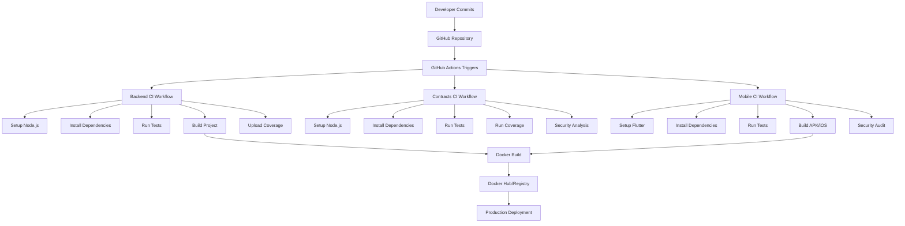

# Cwork Software Supply Chain Security Framework

## Phase 1: Discovery & Risk Assessment (Weeks 1-2)

### TODO 1.1: Map the entire software supply chain

#### Current CI/CD Workflow Diagram

#### Integrated Third-Party Services Inventory

1. **Version Control**: GitHub
2. **CI/CD**: GitHub Actions
3. **Package Registries**:
   - npm (Node.js packages)
   - Pub (Flutter/Dart packages)
   - Crates.io (Rust packages for Solana)
4. **Container Registry**: Docker Hub (potential)
5. **Security Tools**:
   - Codecov (coverage reporting)
   - Slither (smart contract analysis)
   - Mythril (smart contract analysis)
6. **Blockchain Networks**:
   - Ethereum (via Infura)
   - Solana (mainnet-beta)

#### Build Environments, Runners, and Agents

- **CI Runners**: GitHub-hosted Ubuntu latest
- **Build Environments**:
  - Node.js 18 for backend and contracts
  - Flutter 3.13.0 for mobile
  - PostgreSQL 13 for database testing
- **Agents**: GitHub Actions runners (ephemeral)

#### Artifact Repositories and Storage Locations

1. **Source Code**: GitHub repositories
2. **Dependencies**: 
   - npm packages (package-lock.json)
   - Dart packages (pubspec.lock)
   - Rust crates (Cargo.lock)
3. **Build Artifacts**:
   - Docker images (built locally)
   - Flutter APK/iOS builds
   - Smart contract ABIs and bytecode
4. **Storage**: GitHub Actions artifacts (temporary), local Docker registry

### TODO 1.2: Identify critical assets and threat models

#### Crown Jewel Assets

1. **Signing Keys**:
   - JWT secrets for authentication
   - Private keys for blockchain transactions
   - API keys for third-party services

2. **Production Access Credentials**:
   - Database credentials
   - Cloud provider access keys
   - Deployment tokens

3. **Intellectual Property**:
   - Smart contract source code
   - Proprietary algorithms
   - User data

#### Threat Modeling

**Stage: Source Code Management**
- Attack Vector: Compromised developer account
- Impact: Malicious code injection, secret leakage
- Mitigation: 2FA, signed commits, branch protection

**Stage: Dependency Management**
- Attack Vector: Malicious dependency package
- Impact: Supply chain attack, backdoor insertion
- Mitigation: SCA tools, locked dependencies, curated proxies

**Stage: CI/CD Pipeline**
- Attack Vector: Hijacked pipeline runner
- Impact: Artifact tampering, credential theft
- Mitigation: Ephemeral runners, isolated environments

**Stage: Deployment**
- Attack Vector: Unauthorized deployment access
- Impact: Production system compromise
- Mitigation: RBAC, signed artifacts, policy enforcement

#### Documented Attack Vectors

1. **Compromised Developer Account**: Attacker gains access to push malicious code
2. **Dependency Poisoning**: Malicious package in npm/Pub registry
3. **Pipeline Hijacking**: Compromised GitHub Actions runner
4. **Secret Leakage**: Hardcoded credentials in source code
5. **Artifact Tampering**: Modified Docker images or build outputs
6. **Unauthorized Deployment**: Rogue deployment to production

## Next Steps

Proceeding to Phase 2: Foundational Security & Hardening to address identified risks.
## Phase 2: Foundational Security & Hardening (Weeks 3-6)

### TODO 2.1: Enforce strict access controls (Principle of Least Privilege)

#### Current Access Control Assessment

**GitHub Repository Access:**
- No branch protection rules configured
- No required pull request reviews
- No status checks enforcement
- No signed commits requirement

**CI/CD Permissions:**
- GitHub Actions has broad permissions
- No RBAC enforcement for deployment
- No 2FA enforcement for contributors

#### Implementation Plan

1. **GitHub Branch Protection Rules**:
   - Require pull request reviews before merging
   - Require status checks to pass before merging
   - Require signed commits for all branches
   - Restrict force pushes and deletions

2. **Role-Based Access Control (RBAC)**:
   - Define roles: Developers, Reviewers, Admins, Deployers
   - Assign minimal permissions per role
   - Regular access reviews every quarter

3. **Two-Factor Authentication (2FA)**:
   - Mandate 2FA for all GitHub contributors
   - Enforce 2FA for all CI/CD system access
   - Regular 2FA compliance audits

4. **API Key and Credential Rotation**:
   - Rotate all existing API keys and tokens
   - Implement automated key rotation schedule
   - Use short-lived tokens where possible

### TODO 2.2: Secrets Management

#### Current Secrets Assessment

**Identified Risks:**
- Hardcoded secrets in environment files (`.env`, `.env.production`)
- No centralized secrets management
- Secrets exposed in GitHub Actions workflows
- No secrets scanning in place

#### Implementation Plan

1. **Secrets Scanning Implementation**:
   - Integrate TruffleHog or Gitleaks for secret detection
   - Add pre-commit hooks to prevent secret commits
   - Implement CI/CD pipeline secret scanning

2. **Centralized Secrets Management**:
   - Evaluate HashiCorp Vault vs AWS Secrets Manager
   - Migrate all secrets to centralized storage
   - Implement secrets rotation policies

3. **CI/CD Secrets Handling**:
   - Use GitHub Secrets for sensitive data
   - Implement runtime secrets injection
   - Avoid environment variable exposure

4. **Emergency Response Plan**:
   - Define secret rotation procedures
   - Establish breach response protocols
   - Implement secret revocation capabilities

### TODO 2.3: Source Code Security

#### Current Source Code Assessment

**Security Gaps:**
- No mandatory code reviews
- No automated security scanning
- No commit signing requirements
- Limited static analysis

#### Implementation Plan

1. **Code Review Enforcement**:
   - Require at least one approved review for all PRs
   - Establish security-focused review checklist
   - Train developers on security review techniques

2. **Automated Security Scanning**:
   - Integrate SAST tools (SonarQube, Snyk Code)
   - Implement pre-merge security scans
   - Block merges with critical vulnerabilities

3. **Commit Signing Requirements**:
   - Mandate GPG-signed commits for all contributors
   - Reject unsigned commits in protected branches
   - Provide developer training on commit signing

4. **Static Analysis Integration**:
   - Add ESLint security rules for TypeScript
   - Implement Solidity security linters
   - Include Flutter/Dart security analysis

## Next Steps

Proceeding to Phase 3: Dependency & Build Security to address package management and CI/CD pipeline hardening.
## Phase 3: Dependency & Build Security (Weeks 7-10)

### TODO 3.1: Secure Dependency Management

#### Current Dependency Assessment

**Package Management Practices:**
- npm packages managed via package-lock.json
- Dart packages managed via pubspec.lock
- Rust crates managed via Cargo.lock
- No dependency vulnerability scanning
- No Software Composition Analysis (SCA) tools
- Limited pinned dependency versions

**Identified Risks:**
- Potential for dependency confusion attacks
- No automated vulnerability detection
- Lack of curated internal registries
- Insufficient dependency provenance verification

#### Implementation Plan

1. **Dependency Vulnerability Scanning**:
   - Integrate Snyk or GitHub Dependabot for automated scanning
   - Implement daily dependency vulnerability checks
   - Block builds with critical vulnerabilities
   - Establish vulnerability triage process

2. **Dependency Pinning and Lock Files**:
   - Enforce strict version pinning for all dependencies
   - Regularly update lock files with security patches
   - Implement automated dependency updates with security review
   - Use checksum verification for critical packages

3. **Curated Internal Registries**:
   - Evaluate Artifactory or Nexus for internal package management
   - Create curated allowlists for external dependencies
   - Implement mirroring for critical external registries
   - Enforce internal registry usage for all builds

4. **Provenance and Integrity Verification**:
   - Implement Sigstore/cosign for package signing verification
   - Require SLSA provenance for critical dependencies
   - Verify package checksums against published values
   - Reject unsigned or unverified packages

### TODO 3.2: Harden the CI/CD Pipeline

#### Current CI/CD Assessment

**GitHub Actions Workflow Analysis:**
- Backend CI: Node.js setup, testing, coverage
- Contracts CI: Security analysis, testing, coverage
- Mobile CI: Flutter setup, testing, security audit
- No pipeline integrity verification
- Limited isolation between jobs
- No artifact signing or verification

**Security Gaps:**
- Ephemeral runners but no additional isolation
- No step-level security controls
- Limited logging and audit trails
- No pipeline execution policy enforcement

#### Implementation Plan

1. **Pipeline Isolation and Sandboxing**:
   - Implement job-level isolation using separate runners
   - Use GitHub Actions reusable workflows for security consistency
   - Restrict network access for build environments
   - Implement build sandboxing for sensitive operations

2. **Artifact Integrity and Signing**:
   - Implement cosign for Docker image signing
   - Sign all build artifacts (APKs, contracts, binaries)
   - Verify artifact signatures before deployment
   - Maintain artifact provenance records

3. **Pipeline Security Controls**:
   - Implement step-level security policies
   - Require approval for sensitive pipeline steps
   - Enforce maximum privilege principles for each job
   - Regular pipeline configuration security reviews

4. **Audit Logging and Monitoring**:
   - Enable detailed GitHub Actions audit logging
   - Implement real-time pipeline execution monitoring
   - Set up alerts for suspicious pipeline activities
   - Regular pipeline security posture assessments

## Next Steps

Proceeding to Phase 4: Artifact & Deployment Security to address secure storage and deployment practices.